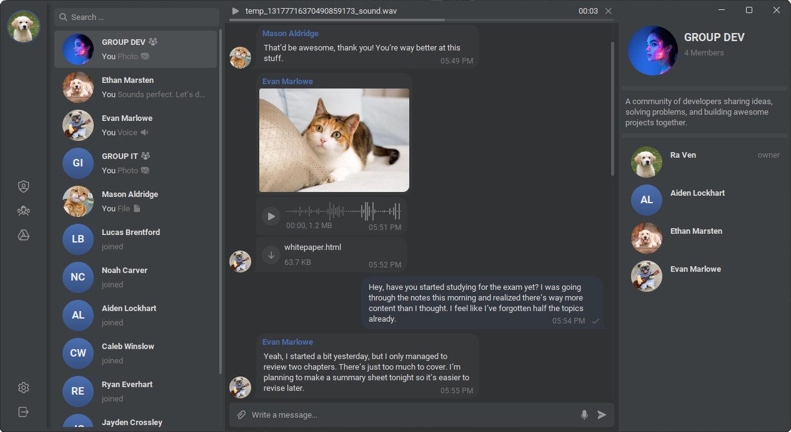
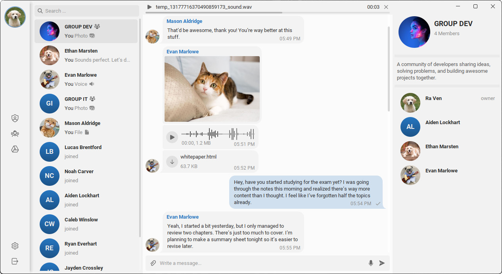

# Java Messenger

This is a simple messenger application built with Java Swing for the client, Node.js for the API server, and Socket.IO
for real-time communication. The client interface is styled using FlatLaf to provide a modern desktop UI.

> **Note:** This project is still in development.




## Messenger Server (Node.js)

Folder contents:

```text
.
└── messenger-server/
    ├── src
    ├── Dockerfile
    ├── docker-compose.yml
    ├── .env
    └── db/
        └── messenger_db.sql
```

## Running the Server with Docker

#### **1. Make sure Docker is installed**

```bash
docker --version
```

#### **2. Navigate to the server folder**

```bash
cd messenger-server
```

#### **3. Build and start the server + MySQL**

```bash
docker compose up --build
```

This will:

- Build the Node.js server from `Dockerfile`
- Start a MySQL 8.0 database
- Import the SQL file from `db/messenger_db.sql`

#### **4. Wait for MySQL to finish starting**

The first startup may take a few seconds.
watch the terminal until both containers show ready messages.

## Library Resources (Client)

- [FlatLaf](https://github.com/JFormDesigner/FlatLaf) - Modern cross-platform look and feel for Java Swing.
- [MigLayout](https://github.com/mikaelgrev/miglayout) - Flexible layout management.
- [Swing Modal Dialog](https://github.com/DJ-Raven/swing-modal-dialog) - Modal and toast notification.